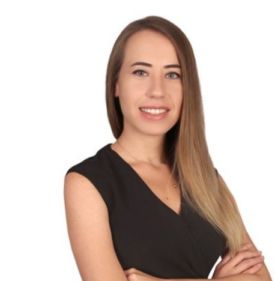

{fig-align="center" width="200px"}

# Education

-   M.S., Industrial Engineering, Hacettepe University, Turkey, 2024 - ongoing.
-   B.S., Industrial Engineering, TOBB University, Turkey, 2013 - 2018.

# Work Experience

## Employements

1.  ROKETSAN, Production Planning Engineer, 2023-2026

2.  FNSS, Production Planning Engineer, 2018-2023

## Internships

1.  FNSS, Production Planning Intern, 2018

2.  TURK TRAKTOR, S&OP Intern, 2017

# Publications

1.  S. G. Karatop, B. Karatop, and E. Ozcan, "A Fuzzy Logic-Based Strategic Roadmap Model for the Defense Industry within the Framework of Turkiye's 12th Development Plan," *Proc. SAVTEK 2024 National Defence Sciences Congress*, Ankara, Turkiye, 2024. \[Online\]. Available: [SAVTEK 2024 Abstract Book](https://savtek.metu.edu.tr/wp-content/uploads/2024/09/SAVTEK-2024-Bildiri-Ozetleri.pdf)

# Competencies

VBA, R, Git, Github

# I enjoy

{width="100px"} Researching

{width="100px"} Yoga

# Links

[Curriculum Vitae](assets/files/CV.pdf)
